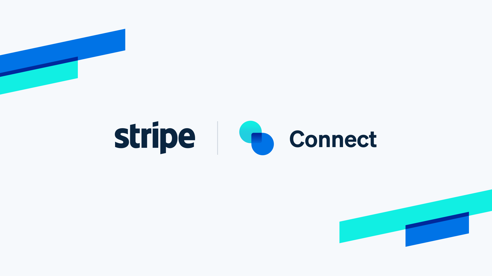

# 💸 Escrow Payment Platform

## 🔐 Introduction
This web application provides a secure platform for processing escrow payments. It allows buyers to make payments that are held for 2 days before being released to sellers. The platform ensures trust between buyers and sellers by mediating payments securely.

---

## ✨ Features
- **🔒 Escrow Payments:** Automatically hold payments for a specified duration (default: 2 days) before releasing them to sellers.
- **💳 Stripe Integration:** Built-in Stripe payment processing for seamless transactions.
- **🔑 User Authentication:** Secure login/signup system for buyers and sellers.
- **💰 Seller Payouts:** Automate payouts to seller accounts after the hold period.
- **📊 Dashboard:** User-friendly dashboards for buyers and sellers to manage transactions.
- **🛠️ Admin Controls:** Admins can view, manage, and audit all transactions.

---

## 🛠️ Use Cases
1. **🛍️ Marketplaces:**
   - Facilitate secure transactions in e-commerce platforms by holding payments until the buyer confirms the delivery.
2. **👨‍💻 Freelance Platforms:**
   - Mediate payments between clients and freelancers to ensure work is completed before releasing funds.
3. **🏠 Rental Services:**
   - Hold payments for services or items rented, releasing them after a satisfactory return or service completion.
4. **🎟️ Event Ticketing:**
   - Secure payments for event bookings, holding funds until the event has concluded.

---

## 🖥️ Tech Stack
- **🖌️ Frontend:** React, Tailwind CSS
- **🔧 Backend:** Node.js, Express.js
- **📦 Database:** MongoDB
- **💳 Payments:** Stripe API
- **🔐 Authentication:** JSON Web Tokens (JWT)

---

## 🚀 Installation

### 📋 Prerequisites
- Node.js and npm installed
- MongoDB database
- Stripe account

###  🛠️ Steps
#### Clone the repository:
```
   git clone https://github.com/Keval9247/escrow-payments-app.git
   cd escrow-payments-app
```
#### Install dependencies:
#### For Frontend :
```
cd frontend
npm install 
```
#### For Backend :
```
cd backend
npm install 
```

#### Set up environment variables: Create a .env file in the root directory with the following keys:
```
SESSION_SECRET=your-session-secret
STRIPESECRETKEY=your-stripe-secret-key
DATABASE_URL=your-mongodb-connection-url
```

#### Run the application:
- for Frontend :  
```
npm run dev
```
- for Backend : 
```
npm run start
```


Access the application at **http://localhost:5173** .

## 🎥 Demo Video

#### Watch the video walkthrough to see the platform in action:

[](./assets/stripeConnectDemo.mp4)

> 📹 Click the above image or [download the demo video](./assets/stripeConnectDemo.mp4) to see the application in action.


## 📸 Screenshots
### 🛒 Buyer Dashboard


### 🛍️ Seller Dashboard


## 📜 License

This extension is licensed under the 
[MIT License](https://choosealicense.com/licenses/mit/).

